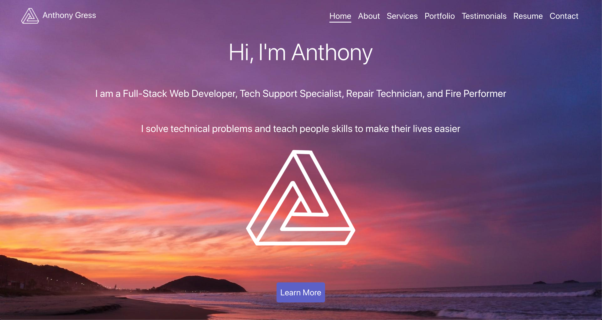

# React Portfolio [](https://opensource.org/licenses/MIT)

## Screenshot

<a href="https://techx-guy.github.io/React-Portfolio/" target="_blank"><div align="center">

</div></a>

# [Live Site](https://techx-guy.github.io/React-Portfolio/)

## Description

A front-end protfolio website developed in React. This utilizes incapsulation and modularity pulling in only the components that are needed, at the time they are needed. Making this a very minimal and performant website.

## Table of Contents

- [Description](#Description)
- [Installation](#Installation)
- [Usage](#Usage)
- [Tests](#Tests)
- [License](#License)
- [Collaboration](#Collaboration)

## Installation

### Dependencies: **Requires** **_Node.js_** installed on your computer

To install the npm dependencies cd into the main directory and run:

```
yarn
```

## Usage

This site is live at [React Portfolio](https://techx-guy.github.io/React-Portfolio/)

To use this node app and create your own local server, clone the repo down, use the terminal to cd into the root directory. Then run:

```
yarn start
```

Use the terminal and start up the server. You can then access the API endpoints through a web browser or Insomnia.

### Build

To build and deploy this application to gh-pages run

```
yarn deploy
```

## Tests

To test please run:

```
yarn test
```

## License

[MIT License](https://opensource.org/licenses/MIT)

## Collaboration

Please feel free to collaborate with me on this project! Just fork it and submit a well documented pull request.

If you have any questions, please contact me at techx@opayq.com

**This app is strictly for educational purposes only**
